<a href="https://ayuxcyb.fun"></a>

  <a href="https://ayuxcyb.fun"><b>ayuxcyb.fun</b></a>
  &nbsp;·&nbsp;
  <a href="https://www.linkedin.com/in/ayuxcyb/">LinkedIn</a>
  &nbsp;·&nbsp;
  <a href="mailto:ayushmandas.dudul@gmail.com">Email</a>
  &nbsp;·&nbsp;
  <a href="https://github.com/arx-studios">Arx Studios</a>

 

  <a href="https://axl.arxstudios.pro"></a>
  <a href="https://chronovault-psi.vercel.app"></a>
  <a href="https://macnook.vercel.app"></a>
  <a href="https://github.com/arx-studios"></a>

 

  <a href="https://github.com/cyborgwastaken/NEXION"></a>&nbsp;&nbsp;&nbsp;<a href="https://play.unity.com/en/games/b84e5e1e-516c-47b0-a345-73aba7ed97eb/webbuild"></a>

  <a href="https://github.com/cyborgwastaken/PewPewWaves"></a>&nbsp;&nbsp;&nbsp;<a href="https://github.com/cyborgwastaken/TrajectoryTitans"></a>

  <a href="https://github.com/cyborgwastaken/ArtificialLife"></a>&nbsp;&nbsp;&nbsp;<a href="https://github.com/cyborgwastaken/ResidentRaver"></a>

 

  <a href="https://github.com/arx-studios/arx-native-executable"></a>&nbsp;&nbsp;&nbsp;<a href="https://github.com/cyborgwastaken/ArxCy"></a>

  <a href="https://github.com/arx-studios/arxchess"></a>&nbsp;&nbsp;&nbsp;<a href="https://arx-killfeed.vercel.app"></a>

  <a href="https://github.com/cyborgwastaken/arxstream"></a>&nbsp;&nbsp;&nbsp;

 

  &nbsp;&nbsp;&nbsp;<a href="https://github.com/cyborgwastaken/AMDSlingshot"></a>

 

more, with full write-ups → <a href="https://ayuxcyb.fun/work"><b>ayuxcyb.fun/work</b></a>

