  <a href="https://ayuxcyb.fun"><b>ayuxcyb.fun</b></a>
  &nbsp;·&nbsp;
  <a href="https://www.linkedin.com/in/ayuxcyb/">LinkedIn</a>
  &nbsp;·&nbsp;
  <a href="mailto:ayushmandas.dudul@gmail.com">Email</a>
  &nbsp;·&nbsp;
  <a href="https://github.com/arx-studios">Arx Studios</a>

 

  
  
  
  

  
  
  
  
  
  
  
  
  
  
  
  

more, with full write-ups → <a href="https://ayuxcyb.fun/work"><b>ayuxcyb.fun/work</b></a>

