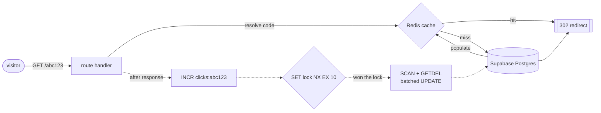
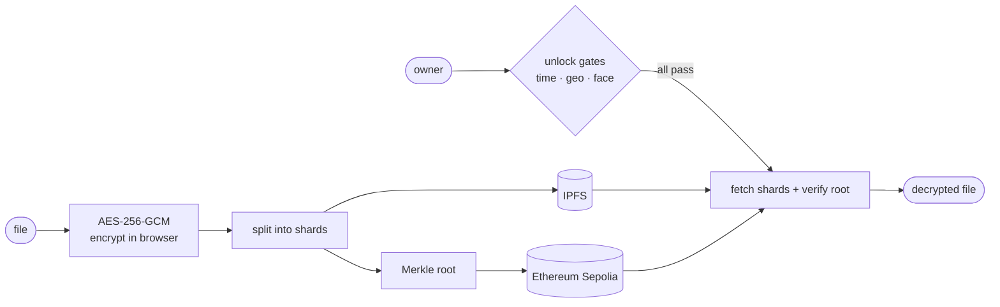
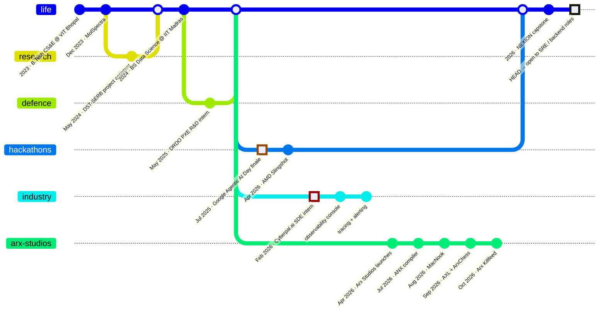

<a href="https://ayuxcyb.fun"></a>

<p align="center">
  <a href="https://ayuxcyb.fun"></a>
  <a href="https://www.linkedin.com/in/ayuxcyb/"></a>
  <a href="mailto:ayushmandas.dudul@gmail.com"></a>
  <a href="https://github.com/arx-studios"></a>
  <a href="https://www.instagram.com/cyborgwastaken/"></a>
</p>

I keep production boring so the product can be exciting. By day I build observability and reliability tooling for a live
cybersecurity GRC platform at **[Cyberpal.ai](https://ayuxcyb.fun/about)**: metrics, tracing, alerting, the works. After hours I run
**[Arx Studios](https://github.com/arx-studios)**, where I write compilers, ship web products and build games.

This README is a little production system too. The board below is live, the stats redraw themselves every night, and the map
and diagrams are interactive. Go ahead and poke at it.

<br />

## Play chess against my README

Anyone can play. Pick a move, submit the issue it opens, and a GitHub Action plays it, lets Stockfish answer and redraws this
board, usually in under a minute.

<!--CHESS:START-->
<p align="center"></p>

<p align="center"><b>Game #1 · move 2 · you're White, your move.</b><br />
<sub>Stockfish (skill 4/20) plays Black and replies instantly. Last turn: [@cyborgwastaken](https://github.com/cyborgwastaken) played `e4`, Stockfish replied `d5`.</sub></p>

<details>
<summary><b>♟️ Make a move</b>: 31 legal moves. Click one, then hit <i>Submit new issue</i>.</summary>
<br />

| Piece | Moves |
|---|---|
| ♙ Pawn on `a2` | [`a3`](https://github.com/cyborgwastaken/cyborgwastaken/issues/new?title=chess%7Cmove%7Ca2a3&body=Just%20press%20%2A%2ASubmit%20new%20issue%2A%2A.%20The%20game%20updates%20automatically%20within%20a%20minute%20or%20so.) · [`a4`](https://github.com/cyborgwastaken/cyborgwastaken/issues/new?title=chess%7Cmove%7Ca2a4&body=Just%20press%20%2A%2ASubmit%20new%20issue%2A%2A.%20The%20game%20updates%20automatically%20within%20a%20minute%20or%20so.) |
| ♙ Pawn on `b2` | [`b3`](https://github.com/cyborgwastaken/cyborgwastaken/issues/new?title=chess%7Cmove%7Cb2b3&body=Just%20press%20%2A%2ASubmit%20new%20issue%2A%2A.%20The%20game%20updates%20automatically%20within%20a%20minute%20or%20so.) · [`b4`](https://github.com/cyborgwastaken/cyborgwastaken/issues/new?title=chess%7Cmove%7Cb2b4&body=Just%20press%20%2A%2ASubmit%20new%20issue%2A%2A.%20The%20game%20updates%20automatically%20within%20a%20minute%20or%20so.) |
| ♙ Pawn on `c2` | [`c3`](https://github.com/cyborgwastaken/cyborgwastaken/issues/new?title=chess%7Cmove%7Cc2c3&body=Just%20press%20%2A%2ASubmit%20new%20issue%2A%2A.%20The%20game%20updates%20automatically%20within%20a%20minute%20or%20so.) · [`c4`](https://github.com/cyborgwastaken/cyborgwastaken/issues/new?title=chess%7Cmove%7Cc2c4&body=Just%20press%20%2A%2ASubmit%20new%20issue%2A%2A.%20The%20game%20updates%20automatically%20within%20a%20minute%20or%20so.) |
| ♙ Pawn on `d2` | [`d3`](https://github.com/cyborgwastaken/cyborgwastaken/issues/new?title=chess%7Cmove%7Cd2d3&body=Just%20press%20%2A%2ASubmit%20new%20issue%2A%2A.%20The%20game%20updates%20automatically%20within%20a%20minute%20or%20so.) · [`d4`](https://github.com/cyborgwastaken/cyborgwastaken/issues/new?title=chess%7Cmove%7Cd2d4&body=Just%20press%20%2A%2ASubmit%20new%20issue%2A%2A.%20The%20game%20updates%20automatically%20within%20a%20minute%20or%20so.) |
| ♙ Pawn on `f2` | [`f3`](https://github.com/cyborgwastaken/cyborgwastaken/issues/new?title=chess%7Cmove%7Cf2f3&body=Just%20press%20%2A%2ASubmit%20new%20issue%2A%2A.%20The%20game%20updates%20automatically%20within%20a%20minute%20or%20so.) · [`f4`](https://github.com/cyborgwastaken/cyborgwastaken/issues/new?title=chess%7Cmove%7Cf2f4&body=Just%20press%20%2A%2ASubmit%20new%20issue%2A%2A.%20The%20game%20updates%20automatically%20within%20a%20minute%20or%20so.) |
| ♙ Pawn on `g2` | [`g3`](https://github.com/cyborgwastaken/cyborgwastaken/issues/new?title=chess%7Cmove%7Cg2g3&body=Just%20press%20%2A%2ASubmit%20new%20issue%2A%2A.%20The%20game%20updates%20automatically%20within%20a%20minute%20or%20so.) · [`g4`](https://github.com/cyborgwastaken/cyborgwastaken/issues/new?title=chess%7Cmove%7Cg2g4&body=Just%20press%20%2A%2ASubmit%20new%20issue%2A%2A.%20The%20game%20updates%20automatically%20within%20a%20minute%20or%20so.) |
| ♙ Pawn on `h2` | [`h3`](https://github.com/cyborgwastaken/cyborgwastaken/issues/new?title=chess%7Cmove%7Ch2h3&body=Just%20press%20%2A%2ASubmit%20new%20issue%2A%2A.%20The%20game%20updates%20automatically%20within%20a%20minute%20or%20so.) · [`h4`](https://github.com/cyborgwastaken/cyborgwastaken/issues/new?title=chess%7Cmove%7Ch2h4&body=Just%20press%20%2A%2ASubmit%20new%20issue%2A%2A.%20The%20game%20updates%20automatically%20within%20a%20minute%20or%20so.) |
| ♙ Pawn on `e4` | [`e5`](https://github.com/cyborgwastaken/cyborgwastaken/issues/new?title=chess%7Cmove%7Ce4e5&body=Just%20press%20%2A%2ASubmit%20new%20issue%2A%2A.%20The%20game%20updates%20automatically%20within%20a%20minute%20or%20so.) · [`exd5`](https://github.com/cyborgwastaken/cyborgwastaken/issues/new?title=chess%7Cmove%7Ce4d5&body=Just%20press%20%2A%2ASubmit%20new%20issue%2A%2A.%20The%20game%20updates%20automatically%20within%20a%20minute%20or%20so.) |
| ♘ Knight on `b1` | [`Na3`](https://github.com/cyborgwastaken/cyborgwastaken/issues/new?title=chess%7Cmove%7Cb1a3&body=Just%20press%20%2A%2ASubmit%20new%20issue%2A%2A.%20The%20game%20updates%20automatically%20within%20a%20minute%20or%20so.) · [`Nc3`](https://github.com/cyborgwastaken/cyborgwastaken/issues/new?title=chess%7Cmove%7Cb1c3&body=Just%20press%20%2A%2ASubmit%20new%20issue%2A%2A.%20The%20game%20updates%20automatically%20within%20a%20minute%20or%20so.) |
| ♘ Knight on `g1` | [`Ne2`](https://github.com/cyborgwastaken/cyborgwastaken/issues/new?title=chess%7Cmove%7Cg1e2&body=Just%20press%20%2A%2ASubmit%20new%20issue%2A%2A.%20The%20game%20updates%20automatically%20within%20a%20minute%20or%20so.) · [`Nf3`](https://github.com/cyborgwastaken/cyborgwastaken/issues/new?title=chess%7Cmove%7Cg1f3&body=Just%20press%20%2A%2ASubmit%20new%20issue%2A%2A.%20The%20game%20updates%20automatically%20within%20a%20minute%20or%20so.) · [`Nh3`](https://github.com/cyborgwastaken/cyborgwastaken/issues/new?title=chess%7Cmove%7Cg1h3&body=Just%20press%20%2A%2ASubmit%20new%20issue%2A%2A.%20The%20game%20updates%20automatically%20within%20a%20minute%20or%20so.) |
| ♗ Bishop on `f1` | [`Ba6`](https://github.com/cyborgwastaken/cyborgwastaken/issues/new?title=chess%7Cmove%7Cf1a6&body=Just%20press%20%2A%2ASubmit%20new%20issue%2A%2A.%20The%20game%20updates%20automatically%20within%20a%20minute%20or%20so.) · [`Bb5+`](https://github.com/cyborgwastaken/cyborgwastaken/issues/new?title=chess%7Cmove%7Cf1b5&body=Just%20press%20%2A%2ASubmit%20new%20issue%2A%2A.%20The%20game%20updates%20automatically%20within%20a%20minute%20or%20so.) · [`Bc4`](https://github.com/cyborgwastaken/cyborgwastaken/issues/new?title=chess%7Cmove%7Cf1c4&body=Just%20press%20%2A%2ASubmit%20new%20issue%2A%2A.%20The%20game%20updates%20automatically%20within%20a%20minute%20or%20so.) · [`Bd3`](https://github.com/cyborgwastaken/cyborgwastaken/issues/new?title=chess%7Cmove%7Cf1d3&body=Just%20press%20%2A%2ASubmit%20new%20issue%2A%2A.%20The%20game%20updates%20automatically%20within%20a%20minute%20or%20so.) · [`Be2`](https://github.com/cyborgwastaken/cyborgwastaken/issues/new?title=chess%7Cmove%7Cf1e2&body=Just%20press%20%2A%2ASubmit%20new%20issue%2A%2A.%20The%20game%20updates%20automatically%20within%20a%20minute%20or%20so.) |
| ♕ Queen on `d1` | [`Qe2`](https://github.com/cyborgwastaken/cyborgwastaken/issues/new?title=chess%7Cmove%7Cd1e2&body=Just%20press%20%2A%2ASubmit%20new%20issue%2A%2A.%20The%20game%20updates%20automatically%20within%20a%20minute%20or%20so.) · [`Qf3`](https://github.com/cyborgwastaken/cyborgwastaken/issues/new?title=chess%7Cmove%7Cd1f3&body=Just%20press%20%2A%2ASubmit%20new%20issue%2A%2A.%20The%20game%20updates%20automatically%20within%20a%20minute%20or%20so.) · [`Qg4`](https://github.com/cyborgwastaken/cyborgwastaken/issues/new?title=chess%7Cmove%7Cd1g4&body=Just%20press%20%2A%2ASubmit%20new%20issue%2A%2A.%20The%20game%20updates%20automatically%20within%20a%20minute%20or%20so.) · [`Qh5`](https://github.com/cyborgwastaken/cyborgwastaken/issues/new?title=chess%7Cmove%7Cd1h5&body=Just%20press%20%2A%2ASubmit%20new%20issue%2A%2A.%20The%20game%20updates%20automatically%20within%20a%20minute%20or%20so.) |
| ♔ King on `e1` | [`Ke2`](https://github.com/cyborgwastaken/cyborgwastaken/issues/new?title=chess%7Cmove%7Ce1e2&body=Just%20press%20%2A%2ASubmit%20new%20issue%2A%2A.%20The%20game%20updates%20automatically%20within%20a%20minute%20or%20so.) |

<sub>Game stuck or lost? [Start a new game](https://github.com/cyborgwastaken/cyborgwastaken/issues/new?title=chess%7Cnew&body=Just%20press%20%2A%2ASubmit%20new%20issue%2A%2A.%20The%20game%20updates%20automatically%20within%20a%20minute%20or%20so.).</sub>
</details>

| 🏆 Visitors vs Stockfish | 🕹️ Latest moves | 👑 Most moves played |
|:-:|:-:|:-:|
| **0** wins · **0** losses · **0** draws | [@cyborgwastaken](https://github.com/cyborgwastaken) `e4` | [@cyborgwastaken](https://github.com/cyborgwastaken) (1) |
<!--CHESS:END-->

<br />

## Deployments

<sub>🟢 live in production &nbsp;·&nbsp; 🔵 shipped &nbsp;·&nbsp; 🟡 in active development &nbsp;·&nbsp; 🏆 hackathon finalist</sub>

#### Web, backend & infrastructure

| | Service | What it does | Stack |
|:-:|---|---|---|
| 🟢 | **[AXL](https://axl.arxstudios.pro)** | URL shortener: Redis cache-aside redirects, batched click counting, per-user links, rate limiting | `Next.js` `Supabase` `Redis` |
| 🟢 | **[ChronoVault](https://chronovault-psi.vercel.app)** | Files encrypted with AES-256-GCM, sharded onto IPFS, verified by Merkle roots on Ethereum; time/geo locks and a face-biometric gate. Four versions deep. | `React` `IPFS` `Ethereum` `FaceNet` |
| 🟢 | **[Arx Killfeed](https://arx-killfeed.vercel.app)** | Cinematic, scroll-driven Valorant codex, generated statically from a local data pipeline | `Next.js` `GSAP` `Lenis` |
| 🔵 | **[arxstream](https://github.com/cyborgwastaken/arxstream)** | Two-person watch party: synced playback, chat and peer-to-peer webcam | `Node.js` `WebSockets` `WebRTC` |
| 🟡 | **[ArxChess](https://github.com/arx-studios/arxchess)** | Chess platform with Stockfish AI, analysis board, puzzles, engine arena and online rooms | `Next.js` `Stockfish WASM` `WebSockets` |

<details>
<summary><b>🔍 How AXL serves a redirect</b>: click tracking can never slow it down</summary>
<br />

The redirect goes out first. Click tracking runs in Next.js `after()`, buffers in Redis, and gets flushed to Postgres in
batches. Serverless has no background timers, so redirects take turns: whichever request wins a `SET NX EX 10` lock does the
flush, at most once every 10 seconds.


</details>

<details>
<summary><b>🔍 How ChronoVault stores a file</b>: nobody, including the server, ever sees the plaintext</summary>
<br />


</details>

#### Languages, compilers & native

| | Project | What it does | Stack |
|:-:|---|---|---|
| 🟡 | **[ANX](https://github.com/arx-studios/arx-native-executable)** | A small compiled language for DSA practice: tree-walking interpreter **and** LLVM native backend, 20 benchmarks green on both | `Rust` `LLVM 21` |
| 🔵 | **[ArxCy](https://github.com/cyborgwastaken/ArxCy)** | A beginner-friendly, statically typed language that transpiles to C | `C++17` `ANTLR4` |
| 🟡 | **[MacNook](https://macnook.vercel.app)** | Press Space on a folder in Finder and actually see what's inside: a Quick Look extension | `Swift` `SwiftUI` `Next.js` |

#### AI & machine learning

| | Project | What it does | Stack |
|:-:|---|---|---|
| 🏆 | **[PersonaFi](https://github.com/cyborgwastaken/PersonaFi)** | Multi-agent personal finance assistant. **Finale, Google Agentic AI Day 2025, Bengaluru** | `Google ADK` `Gemini` `Vertex AI` `Go` |
| 🏆 | **[NutriQuest](https://github.com/cyborgwastaken/AMDSlingshot)** | Meals become XP for an RPG hero, with Gemini as the in-game Oracle. **AMD Slingshot Prompt-a-thon** | `React 19` `FastAPI` `Gemini` |
| 🔵 | **[ArtificialLife](https://github.com/cyborgwastaken/ArtificialLife)** | Neuroevolution sandbox: creatures with 8-6-3 neural brains learn to forage, with no scripted behaviour | `Unity` `C#` |
| 🔵 | **[Cy-Snake-AI](https://github.com/cyborgwastaken/Cy-Snake-AI)** | A Deep Q-Learning agent that teaches itself Snake | `PyTorch` `Pygame` |

#### Games

| | Game | Pitch | Stack |
|:-:|---|---|---|
| 🟡 | **[NEXION](https://github.com/cyborgwastaken/NEXION)** | Cyberpunk puzzle-adventure built on a human-vs-CPU dual-mode mechanic. Final-year capstone. | `Unity 6` `HDRP` |
| 🟢 | **[Doofus Adventure](https://play.unity.com/en/games/b84e5e1e-516c-47b0-a345-73aba7ed97eb/webbuild)** | 3D pulpit-hopping, built for the Hitwicket game developer challenge. Playable in the browser. | `Unity 6` `C#` |
| 🔵 | **[Pew Pew Waves](https://github.com/cyborgwastaken/PewPewWaves)** | Low-poly wave shooter with adaptive AI and procedural waves | `Unity` |
| 🔵 | **[Trajectory Titans](https://github.com/cyborgwastaken/TrajectoryTitans)** | Projectile physics: every miss costs you a ball | `Unity WebGL` |
| 🔵 | **[Resident Raver](https://github.com/cyborgwastaken/ResidentRaver)** | Side-scrolling zombie platformer with bouncing grenades | `ImpactJS` |

<p align="right"><sub>full write-ups for every project → <a href="https://ayuxcyb.fun/work"><b>ayuxcyb.fun/work</b></a></sub></p>

## `git log --graph --all`



## Regions

<sub>Where this service has been deployed. Drag, zoom and click the pins.</sub>

```geojson
{
  "type": "FeatureCollection",
  "features": [
    { "type": "Feature", "properties": { "title": "Bhubaneswar", "description": "Home base", "marker-color": "#22d3ee", "marker-size": "large", "marker-symbol": "star" }, "geometry": { "type": "Point", "coordinates": [85.8245, 20.2961] } },
    { "type": "Feature", "properties": { "title": "VIT Bhopal", "description": "B.Tech CS&E (8.80) · DST-SERB research project", "marker-color": "#0e7490", "marker-symbol": "college" }, "geometry": { "type": "Point", "coordinates": [76.8513, 23.0775] } },
    { "type": "Feature", "properties": { "title": "IIT Madras", "description": "BS Data Science & Applications (online)", "marker-color": "#0e7490", "marker-symbol": "college" }, "geometry": { "type": "Point", "coordinates": [80.2337, 12.9915] } },
    { "type": "Feature", "properties": { "title": "DRDO PXE, Chandipur", "description": "R&D intern · DRAD-MS & BLADEngine", "marker-color": "#ef4444", "marker-symbol": "rocket" }, "geometry": { "type": "Point", "coordinates": [87.0213, 21.4569] } },
    { "type": "Feature", "properties": { "title": "Bengaluru", "description": "Google Agentic AI Day 2025 finale · PersonaFi", "marker-color": "#f59e0b", "marker-symbol": "star" }, "geometry": { "type": "Point", "coordinates": [77.5946, 12.9716] } },
    { "type": "Feature", "properties": { "stroke": "#22d3ee", "stroke-width": 2, "stroke-opacity": 0.7 }, "geometry": { "type": "LineString", "coordinates": [[85.8245, 20.2961], [76.8513, 23.0775]] } },
    { "type": "Feature", "properties": { "stroke": "#22d3ee", "stroke-width": 2, "stroke-opacity": 0.7 }, "geometry": { "type": "LineString", "coordinates": [[85.8245, 20.2961], [80.2337, 12.9915]] } },
    { "type": "Feature", "properties": { "stroke": "#ef4444", "stroke-width": 2, "stroke-opacity": 0.7 }, "geometry": { "type": "LineString", "coordinates": [[85.8245, 20.2961], [87.0213, 21.4569]] } },
    { "type": "Feature", "properties": { "stroke": "#f59e0b", "stroke-width": 2, "stroke-opacity": 0.7 }, "geometry": { "type": "LineString", "coordinates": [[85.8245, 20.2961], [77.5946, 12.9716]] } }
  ]
}
```

## Stack

<p align="center">
  <br />
  <br />
  
</p>

## Telemetry

<p align="center"></p>

<p align="center">
  <picture>
    <source media="(prefers-color-scheme: dark)" srcset="https://raw.githubusercontent.com/cyborgwastaken/cyborgwastaken/output/github-snake-dark.svg" />
    <source media="(prefers-color-scheme: light)" srcset="https://raw.githubusercontent.com/cyborgwastaken/cyborgwastaken/output/github-snake.svg" />
    
  </picture>
</p>

## Paging policy

```yaml
on_call: ayushman
escalation:
  - sev3: open an issue on any repo                # I read them
  - sev2: linkedin.com/in/ayuxcyb                  # internships, roles, collabs
  - sev1: ayushmandas.dudul@gmail.com              # it's important, I'll reply
  - sev0: you have a game idea or a gnarly backend problem   # page immediately
open_to: [backend, platform / SRE, observability, game dev]
```

<p align="center"><sub>this README is monitored · board, stats and snake are redrawn by GitHub Actions · <a href="https://ayuxcyb.fun">ayuxcyb.fun</a></sub></p>
