<!-- Every panel is a terminal-window SVG generated by profile/build.py (hero: profile/hero/build.py,
     telemetry: profile/telemetry/build.py, refreshed nightly by .github/workflows/telemetry.yml). -->

  
  
  
  
  


  <a href="https://axl.arxstudios.pro"></a>
  <a href="https://chronovault-psi.vercel.app"></a>
  <a href="https://arx-killfeed.vercel.app"></a>
  <a href="https://macnook.vercel.app"></a>
  <a href="https://github.com/arx-studios/arxchess"></a>
  <a href="https://github.com/cyborgwastaken/arxstream"></a>

  <a href="https://github.com/arx-studios/arx-native-executable"></a>
  <a href="https://github.com/cyborgwastaken/ArxCy"></a>

  <a href="https://github.com/cyborgwastaken/PersonaFi"></a>
  <a href="https://github.com/cyborgwastaken/AMDSlingshot"></a>
  <a href="https://github.com/cyborgwastaken/ArtificialLife"></a>
  

  <a href="https://github.com/cyborgwastaken/NEXION"></a>
  <a href="https://play.unity.com/en/games/b84e5e1e-516c-47b0-a345-73aba7ed97eb/webbuild"></a>



